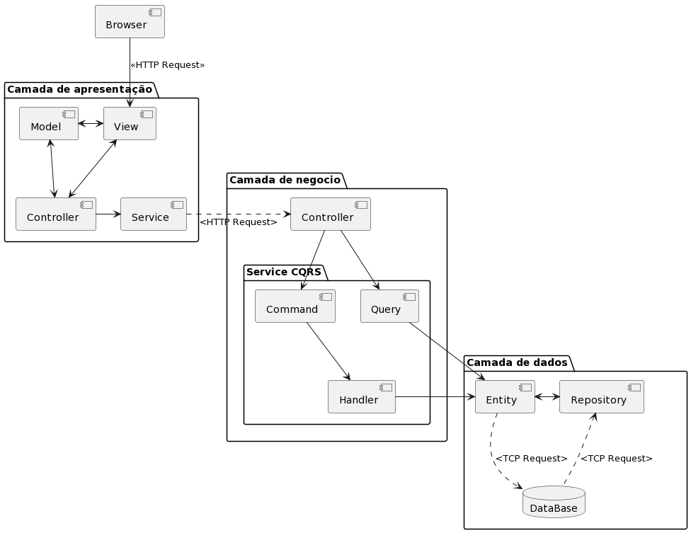

# 1 Objetivo

Este documento fornece uma visão geral da arquitetura abrangente do sistema, usando uma série de visões arquitetônicas diferentes para descrever diferentes aspectos do sistema. O objetivo é capturar e transmitir as decisões arquiteturais significativas que foram tomadas no sistema.

## 1.2 Definições, Acrônimos e Abreviações

> - SGBD - Sistema Gerenciador de Banco de Dados
> - HTTP - Hypertext Transfer Protocol (Protocolo de transferência de hipertexto)
> - CQRS - Command Query Responsibility Segregation

## 1.4 Referências

	Não se aplica

# 2. Metas e Restrições de Arquitetura

Existem algumas restrições de requisito e de sistema principais que têm uma relação significativa com a arquitetura, sendo elas:

> - Utilização do paradigma Orientado a Objetos para odesenvolvimento;
> - Estrutura CQRS;
> - Linguagem TypeScript 4.0;
> - Linguagem de programação PHP 7.4;
> - Linguagem de programação JavaScript;
> - Framework Angular 7.0
> - Framework Symfony 5.2;
> - Banco de dados Sqlite 3;
> - Docker;
> - Apache 2;
> - Nginx

# 3. Visão Logica

Essa sessão descreve as classes mais importantes, sua organização em pacotes de serviços e subsistemas e a organização desses subsistemas em camadas.

## 3.1 Camada de Apresentação
	
Esta camada é responsável por implementar os componentes que representam as interfaces de comunicação entre o sistema e os usuários, a sua implementação se dará através do padrão utilizado pelo framework de apresentação Angular 10.2.
	
## 3.2 Camada de Negocio

A implementação dessa camada será realizada através da liguangem de programação PHP 7.4 onde o padrão de projeto CQRS foi aplicado, e as seguintes subcamadas foram impementadas. 

### 3.2.1 Controller

Contém as classes responsáveis por encaminhar as solicitações às camadas de serviço, obtendo o resultado e retornando ao front-end por meio da API.

A classe mais importante do pacote é AbstractApiController, que é uma especialização de AbstractController. Permite que as subclasses herdem o comportamento RESTful em seus métodos, serializando os retornos e mapeando automaticamente as rotas, com base em métodos HTTP.

### 3.2.2 Entity

Representa o modelo/domínio do sistema. As entidades se relacionam entre si, a fim de representar a interação entre os atores do mundo real. Por meio da biblioteca Doctrine 2, as entidades são abstraídas no modelo relacional do banco de dados.

### 3.2.3 Repository

Subpacote com classes que implementam o padrão de design do Repositório no aplicativo. Para isso, as classes herdam do EntityRepository da biblioteca Doctrine 2, adquirindo as funcionalidades necessárias para lidar com a camada de persistência. Os repositórios têm um relacionamento 1:1 com as entidades.

### 3.2.4 Service

O subpacote Serviço agrupa as classes que orquestram as atividades executadas pelo sistema. É uma derivação do padrão da Camada de Serviço, representado abaixo por Martin Fowler.

Sua função é separar o domínio da aplicação, por meio de uma fachada de serviços, das demais camadas relacionadas aos frameworks utilizados pelo sistema. Esta fachada de serviço é inspirada nos conceitos dos padrões CQRS e Command Bus. É por isso que está dividido nos subpacotes Command, Handler e Query.

### 3.2.5 Command

Ele representa a ação que você deseja executar no sistema. Possuem nomes obrigatórios, como Perfil de Cadastro, e são compostos por atributos que transmitem todas as informações necessárias para que a ação seja realizada.

### 3.2.6 Handler

Contém classes que executam comandos. A relação entre comandos e manipuladores é 1:1.

Todo Handler possui o método handle(), que é responsável por executar o respectivo Comando.

### 3.2.7 Query

São serviços que têm por objetivo consultar informação do modelo, aceder a repositórios, serviços externos, mecanismos de cache e tudo o mais que for necessário.
	
## 3.3 Camada de Dados

A implementação dessa camada se da através da utilização do SGBD Sqlite 3 responsável por manter todos os dados pertinentes ao sistema.

# 4. Visão de Implementação

A implementação do sistema se dará através dos conceitos de programação orientada a objetos por meio dos frameworks Angular e Symfony, serão utilizados os padrões de projeto MVC e CQRS, as linguagens de programação utilizadas serão: 
	
> - TypeScript;
> - Javascript;
> - PHP
	
O sistema estará segredado em três camadas sendo elas, camada de apresentação, camada de negócio e camada de dados, onde serão utilizados os seguintes peças de software para cada camada 

> - Camada de apresentação estará disponível por meio de um servidor Nginx; 
> - Camada de negocio será disponibilizada através de um servidor Apache;
> - Camada de dados será disponibilizada por um servidor Sqlite
